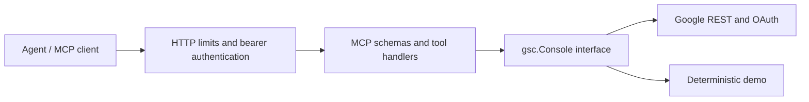

# Architecture

`cmd/mcp-server` wires configuration, lifecycle and dependencies. `internal/httpserver` owns transport boundaries; `internal/auth` owns bearer validation. `internal/mcpserver` translates tool arguments and results. `internal/gsc` owns domain validation and Google integration. Handlers depend on the small capability interface rather than HTTP or credential details; test and demo implementations exercise that boundary.

This structure separates responsibilities without a generic repository or service framework. The four-method interface represents one coherent read-only Search Console capability. Split it only when consumers need independently replaceable capabilities. Protocol schemas remain in the MCP adapter; Google wire-format mapping and retry policy remain in the client.

The server uses stateless Streamable HTTP and has no persistent application database. Each process has its own token cache and concurrency limit. More replicas increase aggregate pressure on Google's shared quotas: coordinate limits externally before scaling replicas. There is no per-user isolation, distributed rate limiter or multi-tenant OAuth flow. Separate installations are the supported boundary for unrelated users.

Cancellation covers queued work, OAuth refresh and upstream requests. Bounded concurrency, retries, request bodies and response bodies constrain resource use. This is suitable for a self-hosted owner or trusted team; no throughput benchmark is claimed.

ACDD describes development history rather than package structure. Each commit must deliver one complete outcome with its tests and dependent files, and pass the checks available at that point.
